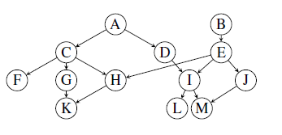

[](https://circleci.com/gh/Hacker-Peers/DependencyExecutorService) [](https://coveralls.io/github/Hacker-Peers/DependencyExecutorService?branch=master)

## Description
This project is a library that aims to facilitate the management of tasks having dependencies with one another.

## Usage
At this current stage, it only helps removing the usual boilerplate code necessary for waiting after the other tasks, but in future versions we might also try to add execution order optimisations and even the automatic passing of job results to the dependent job.

When submitting a job, keep the reference to returned Future and then when submitting depender jobs, simply add the one or many Future the new job depends on as parameter(s), the job's run() method won't be invoked until the other jobs executed successfully. If any of the dependee jobs fail the depender won't be invoked and its own future will return the same exception and the dependee's.  

### Example
Using this library is fairly simple; for example, if you jobs have dependencies that look something like this:



The them would simply be (taken from automated tests):

```Java
DependencyExecutorService subject = DependencyExecutors.newFixedThreadPool(NB_THREADS);

Future<?> kJob = subject.submit(new TestJob(K));
Future<?> lJob = subject.submit(new TestJob(L));
Future<?> mJob = subject.submit(new TestJob(M));

Future<?> fJob = subject.submitWithDependencies(new TestJob(F));
Future<?> gJob = subject.submitWithDependencies(new TestJob(G), kJob);
Future<?> hJob = subject.submitWithDependencies(new TestJob(H), kJob);
Future<?> iJob = subject.submitWithDependencies(new TestJob(I), lJob, mJob);
Future<?> jJob = subject.submitWithDependencies(new TestJob(J), mJob);

Future<?> cJob = subject.submitWithDependencies(new TestJob(C), fJob, gJob, hJob);
Future<?> dJob = subject.submitWithDependencies(new TestJob(D), iJob);
Future<?> eJob = subject.submitWithDependencies(new TestJob(E), hJob, iJob, jJob);

Future<?> aJob = subject.submitWithDependencies(new TestJob(A), cJob, dJob);
Future<?> bJob = subject.submitWithDependencies(new TestJob(B), eJob);
```